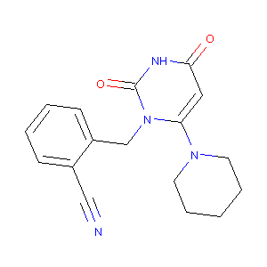
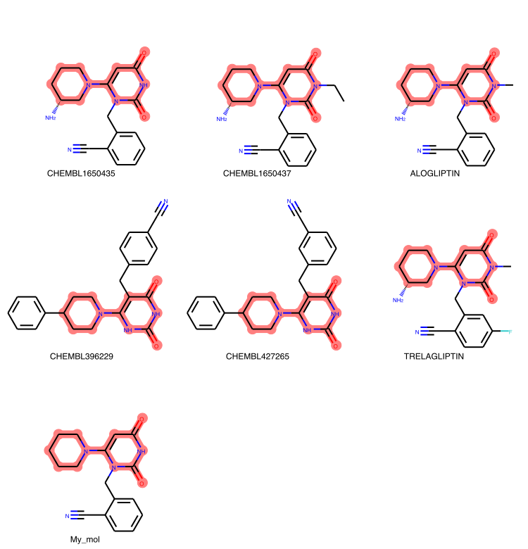

```{r global_options, include=FALSE}
knitr::opts_chunk$set(warning=FALSE, message=FALSE)
```
# Loading the required R libraries and packages
```{r}
library(dplyr)
library(jsonlite)
library(urltools)
library(reticulate)
library(DT)
library(knitr)
library(networkD3)
library(clusterProfiler)
library(ReactomePA)
library(org.Hs.eg.db)
library(visNetwork)
library(tidyverse)
```
```{r, echo = FALSE}
target_ids <- read.csv("equils_target_chembl_uniprot_symbols.txt", sep = "\t", header = T, row.names = NULL, as.is = T)
meta_data_indications_final <- read.csv("meta_data_indications_final.txt", sep = "\t", header = T, row.names = NULL, as.is = T)
```

# Performing a similarity search using ChEMBL web services
## Step 1: Please provide a molecule in SMILES format
```{r}

my_compound <- "N#Cc1ccccc1Cn3c(N2CCCCC2)cc(=O)[nH]c3=O"
baseur_sim <- "https://www.ebi.ac.uk/chembl/api/data/similarity/"

simil_cut_off = "/85"
pba <- fromJSON(paste0(baseur_sim, url_encode(my_compound), simil_cut_off, ".json?limit=50"), flatten=TRUE)

```

```{r}
table_comp_match <- pba$molecules[,c(15,23,55,33,21,60)]


colnames(table_comp_match) <- c("ChEMBL_ID","similarity",
                                "Ro5_violations","withdrawn_info","name","canonical_smiles")

table_comp_match$name <- ifelse(is.na(table_comp_match$name), table_comp_match$ChEMBL_ID, table_comp_match$name)
```

```{python echo=FALSE}
import numpy as np
import pandas as pd

from collections import Counter
from operator import itemgetter

from lxml import etree

from IPython.display import Image, Javascript, HTML, SVG

from rdkit import DataStructs
from rdkit.Chem.Fingerprints import FingerprintMols
from rdkit import Chem, RDConfig
from rdkit.Chem import AllChem, rdMolAlign
from rdkit.Chem import Draw
from rdkit.Chem.Draw import IPythonConsole
from rdkit import rdBase

from rdkit.Chem import rdDepictor
from rdkit.Chem.Draw import rdMolDraw2D
from PIL import Image
from io import BytesIO

my_mol = Chem.MolFromSmiles(r.my_compound)

img = Draw.MolToImage(my_mol)
img.save("molecule.png")

```
# Your query!


```{r echo=FALSE}

table_comp_match %>% 
  dplyr::mutate(ChEMBL_ID = paste0("<a target='_blank' href='https://www.ebi.ac.uk/chembl/beta/compound_report_card/",ChEMBL_ID,"'>",ChEMBL_ID,"</a>")) %>%
  datatable(escape = F, rownames = F, caption = "Similarity search results")
  
```

# Ok, these compunds are similar to my query, but what is the relationship between them?
### Let's perform a clustering analysis based on the similarity all vs all

```{python}
#This code is aimed to generate the similarity matrix by using RDkit
res_df = pd.DataFrame(r.table_comp_match)

list_smiles1=list(res_df.canonical_smiles)
list_smiles=[Chem.MolFromSmiles(x) for x in list_smiles1]
list_smiles.append(my_mol)
list_ids=list(res_df.name)
list_ids.append("My_mol")
my_fps = [FingerprintMols.FingerprintMol(x) for x in list_smiles]

dists = []
simil = []
nfps = len(my_fps)
for j in range(0,nfps):
        simil.append(DataStructs.BulkTanimotoSimilarity(my_fps[j],my_fps))
        res_dis = DataStructs.BulkTanimotoSimilarity(my_fps[j],my_fps,returnDistance=1)
        dists.append([1-x for x in res_dis])
    
simil_mat = np.array(simil)
dist_mat = np.array(dists)
df_dist = pd.DataFrame(dist_mat)
df_simil = pd.DataFrame(simil_mat)
df_simil.columns = list_ids
df_simil.index = list_ids
```

### Clustering results
```{r}
library(heatmaply)
d1 <- dist(py$df_simil, method = "manhattan", diag = FALSE, upper = TRUE)
d2 <- dist(t(py$df_simil), method = "manhattan", diag = FALSE, upper = TRUE)

c1 <- hclust(d1, method = "ward.D2", members = NULL)
c2 <- hclust(d2, method = "ward.D2", members = NULL)

heatmaply(as.matrix(py$df_simil), margins = c(40, 40, 0, 0),
          Rowv=as.dendrogram(c2), Colv=as.dendrogram(c1),
          colors = BrBG
          )
```
# Are the compounds sharing a common sub-structure?
```{python}
from rdkit.Chem import rdFMCS
from collections import namedtuple
from cairosvg import svg2png

mhs = list_smiles
[mhs[j].SetProp('_Name', str(list_ids[j])) for j in range(0, len(mhs))];
mcs = rdFMCS.FindMCS(mhs,threshold=0.8,completeRingsOnly=True,ringMatchesRingOnly=True)
patt = Chem.MolFromSmarts(mcs.smartsString)

AllChem.Compute2DCoords(patt)


matchingMols = [x for x in mhs if x.HasSubstructMatch(patt)]
legends=[x.GetProp("_Name") for x in matchingMols]

for m in matchingMols: AllChem.GenerateDepictionMatching2DStructure(m,patt)

##code for visualizing the sub-structure
hats = []
hbnds = []
for mm in matchingMols:
    ats = mm.GetSubstructMatch(patt)
    hats.append(ats)
    bnds = []
    for bnd in mm.GetBonds():
        if bnd.GetBeginAtomIdx() in ats and bnd.GetEndAtomIdx() in ats:
            bnds.append(bnd.GetIdx())
    hbnds.append(bnds)

molsPerRow = 3
nRows = len(matchingMols)//molsPerRow
if len(matchingMols)%molsPerRow:
    nRows+=1
panelx = 250
panely = 260
canvasx = panelx * molsPerRow
canvasy = panely * nRows
drawer = rdMolDraw2D.MolDraw2DSVG(canvasx,canvasy,panelx,panely)
drawer.DrawMolecules(matchingMols,highlightAtoms=hats,highlightBonds=hbnds, legends=legends)
drawer.FinishDrawing()
svg = drawer.GetDrawingText()
SVG(svg.replace("svg:",""))
svg2png(bytestring=svg,write_to='molecule2.png')

```
Result of the sub-structure search


# Is there any information about the mechanism of action (MOA) of these compounds in ChEMBL?

```{r}
comp_indi <- unique(table_comp_match$name)

df_indi <- dplyr::filter(meta_data_indications_final, name %in% comp_indi)

if(dim(df_indi)[1] == 0) {
  print("No mechanism of action avaliable for these compounds!")
} else {
  df_indi$efo_id <- gsub(':','_', df_indi$efo_id)
  df_indi %>%
    dplyr::mutate(target_chembl_id = paste0("<a target='_blank' href='https://www.ebi.ac.uk/chembl/beta/target_report_card/",target_chembl_id,"'>",target_chembl_id,"</a>")) %>%
    dplyr::mutate(efo_id = paste0("<a target='_blank' href='https://www.ebi.ac.uk/efo/",url_encode(efo_id),"'>",efo_id,"</a>")) %>%
  datatable(escape = F, rownames = F, options = list(autoWidth = T,scrollX = "200px"),caption = "MOA information in ChEMBL")
}
```
# Extracting target bioactivities from Binding assays
```{r}
baseur_act <- "https://www.ebi.ac.uk/chembl/api/data/activity.json?molecule_chembl_id="

len_ids <- length(unique(table_comp_match$ChEMBL_ID))
pba2 <- lapply(table_comp_match$ChEMBL_ID, function(x){
fromJSON(paste0(baseur_act, x, "&assay_type=B&standard_units=nM","&limit=1000"),flatten=TRUE)
})

m <- lapply(1:len_ids, function(x) pba2[[x]]$activities)
m <- do.call(rbind, m)

m <- m[!is.na(m$pchembl_value),]
m <- m[m$potential_duplicate == "FALSE",]
m$molecule_pref_name <- ifelse(is.na(m$molecule_pref_name), m$molecule_chembl_id, m$molecule_pref_name)

target_bioacti <- m[,c(35,37,16,34,32,31,18,36,12)]
target_bioacti_final <- merge(target_ids[,c(1,3)], target_bioacti, by ="target_chembl_id")
target_bioacti_final$pchembl_value <- as.numeric(target_bioacti_final$pchembl_value)

target_bioacti_final %>%
    dplyr::mutate(document_chembl_id = paste0("<a target='_blank' href='https://www.ebi.ac.uk/chembl/beta/document_report_card/",document_chembl_id,"'>",document_chembl_id,"</a>")) %>%
  datatable(escape = F, rownames = F, options = list(autoWidth = T,scrollX = "50px"),caption = "Target bioactivities result")
```
# Analysis of the target bioactivities in the context of protein-protein interactions (PPIs)


```{r, echo=FALSE, results='hide'}
library(igraph)

graph_chembl <- graph_from_data_frame(target_bioacti_final[,c(4,2,8)])
graph_chembl_filt <- igraph::simplify(graph_chembl, remove.multiple = T, remove.loops = T, edge.attr.comb = "mean")
graph_chembl_final <- igraph::get.data.frame(graph_chembl_filt, what = "edges")
colnames(graph_chembl_final) <- c("col_A", "col_B", "score")
graph_chembl_final$type <- "ChEMBL"

```
```{r}
string_api_url <- "https://string-db.org/api"
method <- "interaction_partners"

my_genes <- paste(unique(target_bioacti_final$gene_symbol), collapse = "%0d") 
species <- "9606"
limit <- 20
my_app <- "www.awesome_app.org"

string <- fromJSON(paste0(string_api_url, "/json", "/interaction_partners?","identifiers=", my_genes,"&species=",species,"&limit=",limit,"&caller_identity=",my_app), flatten = T)

string <- string[string$escore >0,]

my_ppis <- string[,c(1,12,11)]
my_ppis$escore <- my_ppis$escore * 10
colnames(my_ppis) <- c("col_A", "col_B", "score")
my_ppis$type <- "PPI"
ppi_chembl <- rbind(graph_chembl_final, my_ppis)
```
# What are the main pathways being pertuberd by these compounds?
### Let's perform an enrichment analysis of Reactome pathways of the targets and their interacting partners
```{r}
symbol_ids <- unique(ppi_chembl$col_B)
entrez_ids = bitr(symbol_ids, fromType="SYMBOL", toType="ENTREZID", OrgDb="org.Hs.eg.db")
enrich <- enrichPathway(gene=entrez_ids$ENTREZID,pvalueCutoff=0.05, readable=T)
enrich_table <- as.data.frame(enrich)
enrich_table_exp <- enrich_table %>% transform(geneID = strsplit(geneID, "/")) %>% unnest(geneID)
enrich_table_exp <- enrich_table_exp[!duplicated(enrich_table_exp$geneID),]
enrich_table_exp$score <- -log(enrich_table_exp$p.adjust)
enrich_table_exp <- enrich_table_exp[,c(2,9,10)]
colnames(enrich_table_exp) <- c("col_A","col_B","score")
enrich_table_exp$type <- "Pathway"

indi_comp <- df_indi[,c(5,1)]
indi_comp <- indi_comp[!duplicated(indi_comp),]
colnames(indi_comp) <- c("col_A","col_B")
indi_comp$score <- 10
indi_comp$type <- "Indication"

indi_tar <- df_indi[,c(5,3)]
indi_tar <- indi_tar[!duplicated(indi_tar),]
colnames(indi_tar) <- c("col_A","col_B")
indi_tar$score <- 10
indi_tar$type <- "Indication"

meta_inte <- rbind(ppi_chembl, enrich_table_exp, indi_comp, indi_tar)
meta_inte$score <- round(meta_inte$score, 2) 
```
```{r, fig.align = "left",fig.height = 8, fig.width = 12, out.width = "100%", out.height= "100%"}
dotplot(enrich, showCategory=20)
```

# Integrative view
```{r}
genes_A <- my_ppis %>% 
  dplyr::distinct(col_A) %>% 
  dplyr::rename(label = col_A)

genes_B <- my_ppis %>%
  dplyr::distinct(col_B) %>% 
  dplyr::rename(label = col_B)

genes_AB <- full_join(genes_A,genes_B, by = "label")

genes_AB$type <- "Gene"

comps <- graph_chembl_final[,c(1,4)]
comps <- comps[!duplicated(comps),]
names(comps)[1] <- "label" 


paths_AB <- enrich_table_exp[,c(1,4)]
paths_AB <- paths_AB[!duplicated(paths_AB),]
names(paths_AB)[1] <- "label"

indi_net <- unique(indi_comp[,c(1,4)])
names(indi_net)[1] <- "label"

labels_type <- rbind(indi_net,comps, genes_AB, paths_AB)

nodes <- labels_type %>%
  dplyr::mutate(id = 1:nrow(labels_type)) %>%
  dplyr::select(id, everything())

my_format <- data.frame(type = c("Indication","ChEMBL","Pathway","Gene"), shape = c("box","diamond","dot","square"))

nodes <- merge(nodes, my_format, by = "type")
nodes <- nodes[,c(2,3,1,4)]
names(nodes)[3] <- "group"
nodes <- nodes[order(nodes$group),]

edges <- meta_inte %>%
  dplyr::left_join(nodes[,1:2], by = c("col_A" = "label")) %>%
  dplyr::rename(from = id)
edges <- edges %>%
  dplyr::left_join(nodes[,1:2], by = c("col_B" = "label")) %>%
  dplyr::rename(to = id)
edges <- dplyr::select(edges, from, to, score)

nodes_d3 <- dplyr::mutate(nodes, id = id - 1)
nodes_d3 <- nodes_d3[order(nodes_d3$id),]

edges_d3 <- dplyr::mutate(edges, from = from - 1, to = to - 1)

sankeyNetwork(Links = edges_d3, Nodes = nodes_d3, Source = "from", Target = "to", Value = "score", NodeID = "label", NodeGroup = "group", units = "", fontSize = 15, nodeWidth = 35, height = 800, width = 1200, sinksRight = F)
```
```{r}
visNetwork(nodes, edges, height = "800px",width = "100%") %>% 
  visGroups(groupname = "ChEMBL", color = "red") %>%
  visGroups(groupname = "Gene", color = "lightblue") %>%
  visGroups(groupname = "Indication", color = "yellow") %>%
  visGroups(groupname = "Pathway", color = "orange") %>%
  visOptions(highlightNearest = list(enabled =TRUE, degree = 2)) %>%
  visNodes(shadow = list(enabled = TRUE, size = 10))
```
